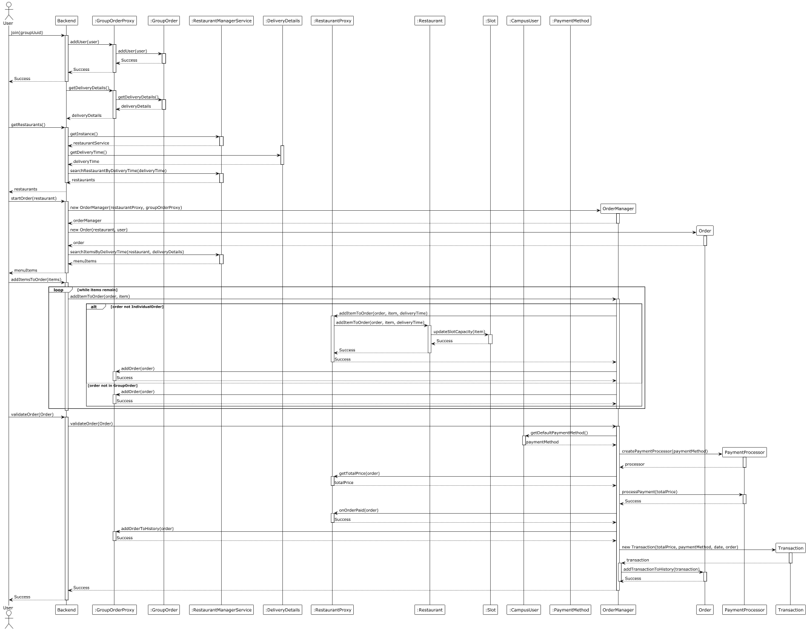

# Conception

## Diagramme de use case

## Diagramme de classe

### Diagramme de classe détaillé par Design Pattern

#### Strategy

#### Singleton

#### Proxy

#### Factory

#### Facade

#### Builder

## Diagramme de séquence

