# 1 Périmètre fonctionnel

## 1.1 Hypothèse de travail

Livraison & temps de préparation:

- Livraison, nous n’avons pas pris en compte le temps de livraison entre le moment où la commande est prête et le moment
  où elle se fait livrer. Donc nous partons du principe qu’il est compris dans le temps de préparation.

Système de paiement:

- Nous avons implémenté une stratégie de paiement qui pour le moment ne fait rien a part faire un affichage. Donc pour
  le moment tous les paiements sont validés automatiquement

## 1.2 Points non implémentés

## 1.3 Fonctionnalités: points forts, points faibles

### 1.3.1 Points forts

### 1.3.2 Points faibles

# 2 Architecture et Justification de l'Architecture

## 2.1 Organisation du code

Le projet est organisé en modules pour une meilleure lisibilité et maintenabilité. Chaque module contient des fichiers
pertinents pour une responsabilité claire :

- **Backend** : Structure en microservices, chacun responsable d'une fonctionnalité unique.
    - Exemple :
        - [Gateway](../../backend/gateway) : Point d'entrée pour les requêtes.
        - [RestaurantsService](../../backend/restaurant) : Gestion des restaurants.
        - [GroupOrderService](../../backend/grouporder) : Gestion des commandes groupées.
        - [DatabaseService](../../backend/bdd) : Actions sur la base de données.
        - [Flexible Rest Server](../../backend/flexiblerestserver) : Custom Framework pour les services REST.
- **Frontend** : Application React structurée par composants avec organisation en dossiers par fonctionnalités (e.g.,
  `components`, `model`, `utils`). Les composants sont réutilisables et modulaires.
    - Exemple :
        - [Components](../../frontend/ste-24-25--teamj-frontend/src/modules/components) : Composants réutilisables.
        - [Model](../../frontend/ste-24-25--teamj-frontend/src/modules/model) : Modèles de données.
        - [Utils](../../frontend/ste-24-25--teamj-frontend/src/modules/utils) : Fonctions utilitaires.

Des liens vers les fichiers importants sont inclus pour guider les développeurs :

- Backend : [Lien vers le répertoire](../../backend)
- Frontend : [Lien vers le répertoire](../../frontend/ste-24-25--teamj-frontend)

## 2.2 Décomposition en services

La solution repose sur une architecture basée sur les microservices, avec une nette séparation des responsabilités :

- **Front-End** :
    - Interagit avec l’API via une passerelle (Gateway).
    - Utilise React pour l’interface utilisateur et TypeScript pour la sécurité et la lisibilité du code.
- **Passerelle (Gateway)** :
    - Accessible depuis l’extérieur.
    - Route les requêtes vers les services internes selon la logique d'affaires.
- **Services internes** :
    - `RestaurantsService` : Gère les données et opérations relatives aux restaurants.
    - `GroupOrderService` : Traite les commandes groupées.
    - `DatabaseService` : Accès et modifications des données dans la base de données.

Les services sont éventuellement décomposables en fonction des besoins futurs.

## 2.3 Entités persistantes

Les entités persistantes de l’application incluent :

- **Restaurant** : Informations relatives aux restaurants.
- **GroupOrder** : Détails sur les commandes groupées.
- **Order**: Informations sur les commandes.
- **CampusUser** : Données des utilisateurs.
- **RestaurantManager** : Gestionnaires de restaurants.
- **Menu** : Détails des menus des restaurants.
- **MenuItem** : Éléments individuels des menus.
- **DeliverLocation** : Informations sur les lieux de livraison.
- ...

Chaque entité est modélisée sous forme d’objets et mappée dans la base de données avec des ORM (Object-Relational
Mapping).

## 2.4 Objets de communication (DTO)

Les DTO (Data Transfer Objects) facilitent la communication entre services. Ces objets sont localisés dans chaque
service sous le dossier `dto` :

- Tous les dossiers dto:
    - [Gateway](../../backend/gateway/src/main/java/fr/unice/polytech/equipe/j/dto)
    - [RestaurantsService](../../backend/restaurant/src/main/java/fr/unice/polytech/equipe/j/dto)
    - [GroupOrderService](../../backend/grouporder/src/main/java/fr/unice/polytech/equipe/j/dto)
    - [DatabaseService/Order](../../backend/bdd/src/main/java/fr/unice/polytech/equipe/j/order/dto)
    - [DatabaseService/Restaurant](../../backend/bdd/src/main/java/fr/unice/polytech/equipe/j/restaurant/dto)
    - [DatabaseService/DeliveryLocation](../../backend/bdd/src/main/java/fr/unice/polytech/equipe/j/deliverylocation/dto)
    - [DatabaseService/User](../../backend/bdd/src/main/java/fr/unice/polytech/equipe/j/user/dto)

- Exemple :
    - `bdd/src/main/java/fr/unice/polytech/equipe/j/restaurant/dto/RestaurantDTO.java`
    - `restaurant/src/main/java/fr/unice/polytech/equipe/j/database/dto/MenuItemDTO.java`
    - ...

Ces DTO standardisent les données transmises et permettent une meilleure validation.

## 2.5 APIs utilisées

L’ensemble des APIs est documenté en OpenAPI (fichiers `openapi.yaml`). Les fichiers pertinents sont disponibles ici :

- Gateway API : [Lien vers ](../openapi/gatewayOpenApi.json)`doc/openapi/gatewayOpenApi.json`
- Restaurants API : [Lien vers ](../openapi/restaurantOpenApi.json)`restaurants/openapi.yaml`
- Group Order API : [Lien vers ](../openapi/grouporderOpenApi.json)`group-order/openapi.yaml`
- Database API : [Lien vers ](../openapi/bddOpenApi.json)`database/openapi.yaml`

## 2.6 Interface utilisateur

L’interface utilisateur est conçue avec :

- **ViteJS** pour une compilation rapide.
- **React** et **TypeScript** pour une architecture frontale modulaire et robuste.
- **TailwindCSS** pour un style rapide et réactif.
- **NextUI** pour des composants rapides et réutilisables.

Lien vers les fichiers front-end : [Frontend](../../frontend/ste-24-25--teamj-frontend).

### Captures d’écran

Voici un exemple de l'interface utilisateur déconnecté:

### Page d'accueil

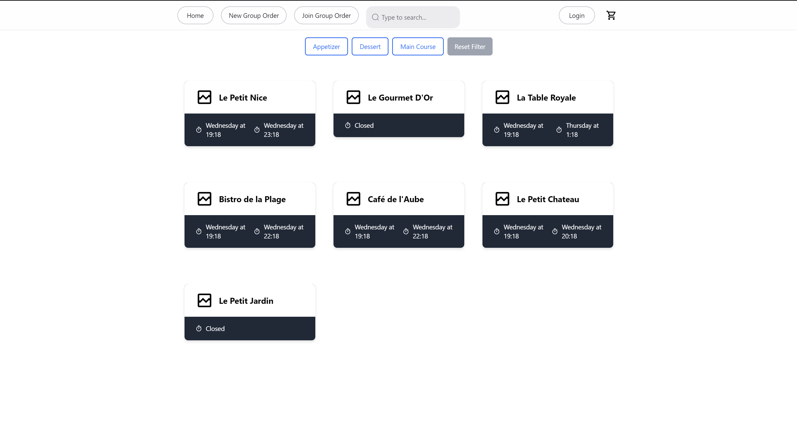

### Filtre par items

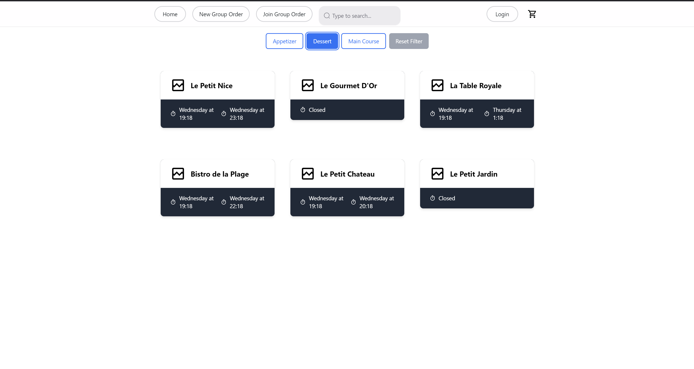

### Recherche par nom

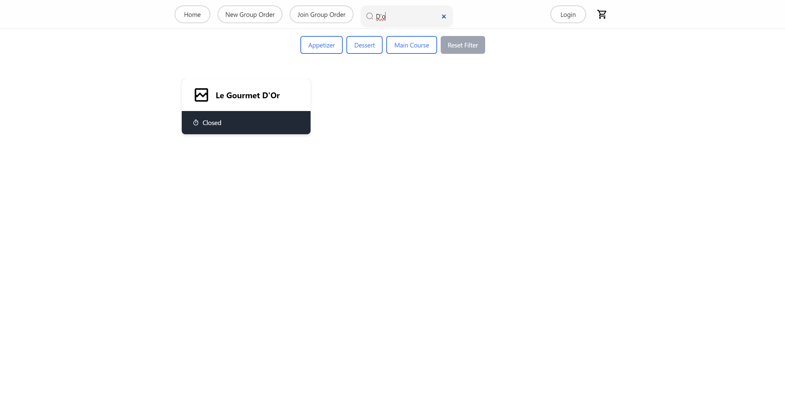

### Affichage du menu d'un restaurant

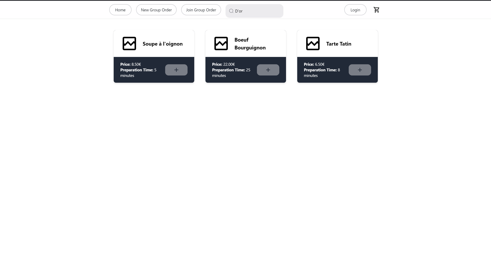

Voici un exemple de l'interface utilisateur connecté, pour un Individual Order:

### Saisie des détails de livraison

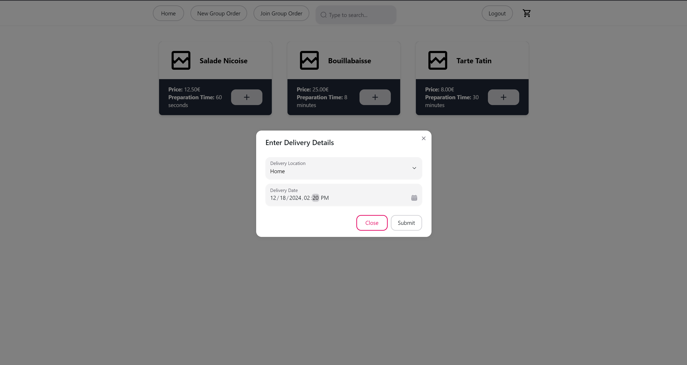

### Ajout d'un item au panier

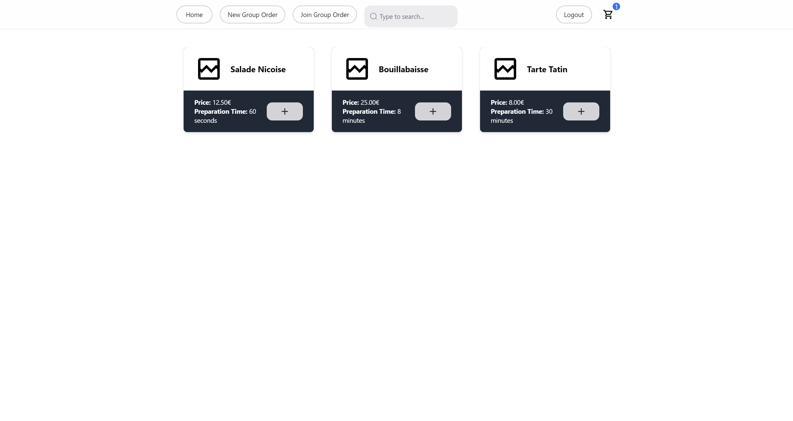

### Affichage du panier

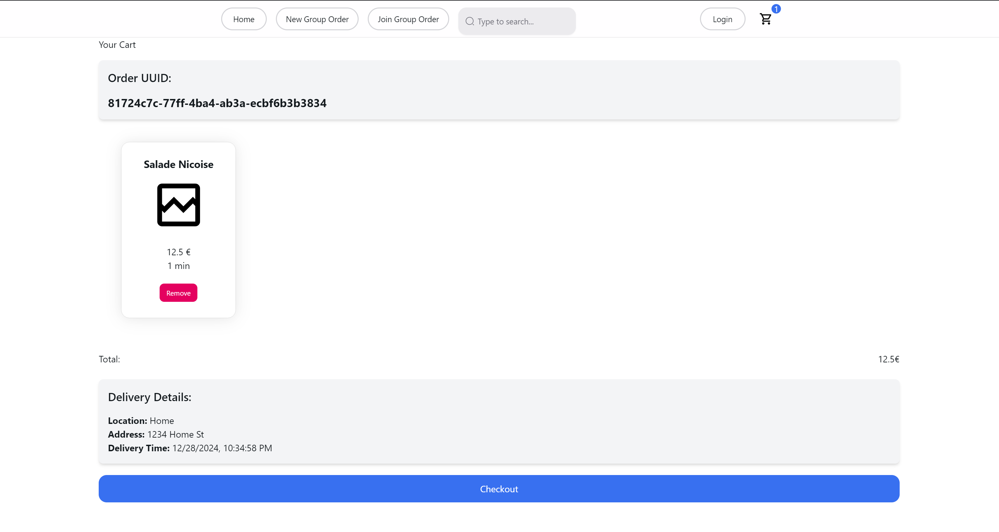

Voici un exemple de l'interface utilisateur connecté, pour un Group Order:

### Création d'une commande groupée

### Affichage du code de la commande groupée

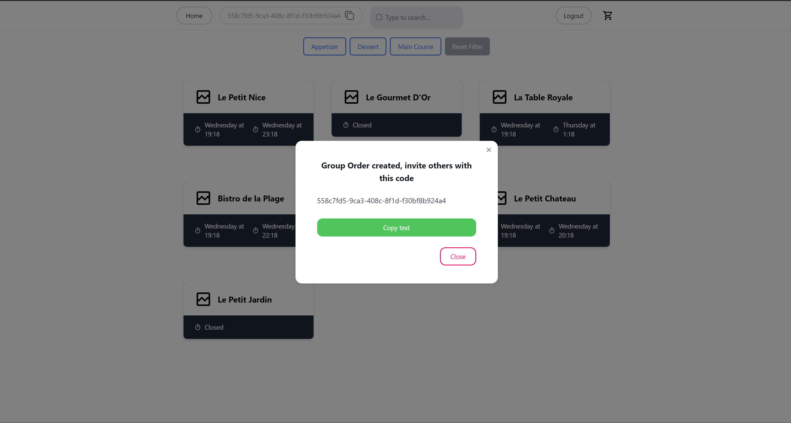

### Rejoindre une commande groupée

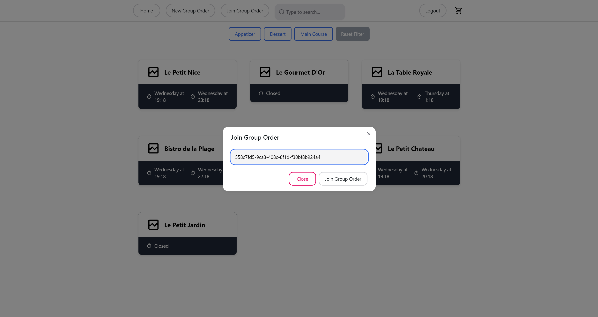

### Affichage du panier pour un utilisateur au sein d'une commande groupée

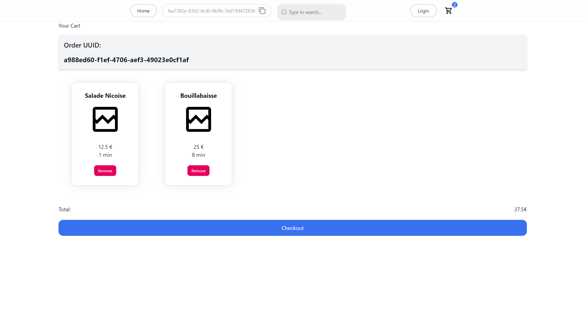

### Validation de la commande groupée, Affichage du récapitulatif de la commande de groupe

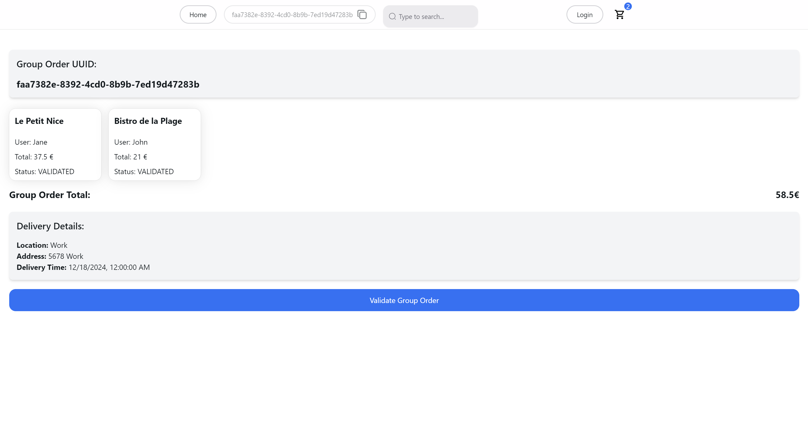

## 2.7 Cheminement des requêtes

### 2.7.1 Récupération des restaurants

1. **Frontend** : Une requête HTTP GET est initiée vers la passerelle (route `/api/restaurants/all`).
2. **Gateway** : Transfère la requête au service `RestaurantsService`.
3. **RestaurantsService** :
    - Interroge la base de données pour récupérer les restaurants. (route `/api/database/restaurants/all`)
    - Retourne une liste formatée via un `RestaurantDTO`.
4. **Frontend** : Affiche les résultats dans une vue utilisateur.

### 2.7.2 Une étape de la prise de commande

1. **Frontend** : Envoie une requête POST pour créer un group order.
2. **Gateway** : Route la requête vers `GroupOrderService`.
3. **GroupOrderService** :
    - Valide les données reçues.
    - Persiste l’entité `GroupOrder` dans la base de données.
4. **Frontend** : Affiche un message de confirmation.

Un diagramme de séquence illustre ces flux (voir [Diagramme](#diagramme-sequence)).

## 2.8 Optimisations réalisées

### Côté Backend

- **FlexibleRestServer** :
    - Serveur REST personnalisable en Java.
    - Réduction des duplications grâce à l’utilisation d’annotations (@Controller, @Route).
    - Standardisation des réponses HTTP.
    - Gain de temps pour le développement de microservices.

### Côté Frontend

- **ViteJS** : Compilation rapide pour un feedback instantané.
- **React et TypeScript** : Meilleure lisibilité et typage fort.
- **TailwindCSS** : Productivité accrue pour le design.
- **NextUI** : Composants réutilisables pour une interface cohérente.

## Conclusion

Cette architecture est conçue pour être scalable, maintenable et simple à prendre en main pour les développeurs.
Les choix techniques réduisent la redondance, améliorent la clarté et permettent une évolution aisée de l’application.

