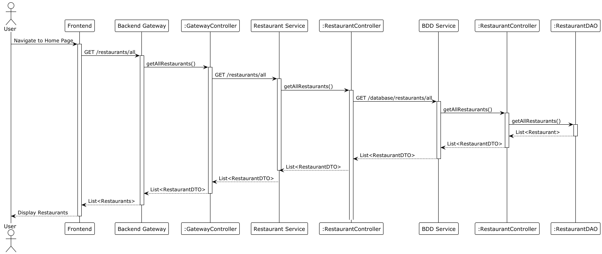

# 1 Périmètre fonctionnel

## 1.1 Hypothèse de travail

Livraison & temps de préparation:

- Livraison, nous n’avons pas pris en compte le temps de livraison entre le moment où la commande est prête et le moment
  où elle se fait livrer. Donc nous partons du principe qu’il est compris dans le temps de préparation.

Système de paiement:

- Nous avons implémenté une stratégie de paiement qui pour le moment ne fait rien a part faire un affichage. Donc pour
  le moment tous les paiements sont validés automatiquement

## 1.2 Points non implémentés
RAS

## 1.3 Fonctionnalités: points forts, points faibles

### Fonctionnalités
Les fonctionnalités suivantes ont été intégralement implémentées conformément aux exigences :

#### 1. Prise de commande au sein d’une commande de groupe

- **Ajout de menus** : Les utilisateurs peuvent ajouter des menus à une commande de groupe, en respectant les délais de préparation. issue #62
- **Paiement** : 
  - Le paiement est géré via un proxy simulant un service de paiement potentiel.
- **Validation de la commande** : Bien que la validation finale de la commande de groupe (fermeture, exigence O6) ne soit pas obligatoire, notre système gère efficacement les commandes jusqu’à l’étape de validation.

#### 2. Création de la commande groupée (O2)

- Accessible depuis l’interface graphique.
- Les utilisateurs peuvent initier une commande groupée et inviter d'autres participants.
- Toutes les commandes associées à un groupe sont organisées et présentées de manière cohérente.

#### 3. Navigation parmi les restaurants et leurs menus

- **Recherche des restaurants** : Les utilisateurs peuvent parcourir les restaurants disponibles.
- **Filtrage par heure de livraison** : 
  - Les menus et restaurants disponibles peuvent être filtrés en fonction de l’heure de livraison souhaitée.
  - Offre une navigation fluide et intuitive à travers les options.


Ces fonctionnalités respectent les attentes du projet tout en offrant une expérience utilisateur fonctionnelle et efficace. Elles peuvent être testées et démontrées avec l’interface graphique fournie.


### 1.3.1 Points forts

1. **Prise de commande au sein d’une commande de groupe**:
   - **Performance**: Le processus de prise de commande est fluide et optimisé pour gérer plusieurs utilisateurs ajoutant des menus simultanément. 
   - **Originalité**: L'implémentation du proxy pour simuler le service de paiement ajoute une flexibilité au système et permet une extensibilité future.
   - **Structuration**: Le système organise efficacement les commandes associées à une commande groupée, assurant une bonne lisibilité et maintenabilité du code.
   - **Issue liée**: [Issue #48](https://github.com/PNS-Conception/STE-24-25--teamj/issues/48)
     
2. **Création de la commande groupée**:
   - **Simplicité**: Interface utilisateur intuitive permettant la création rapide de commandes groupées.
   - **Collaboratif**: Fonctionnalité permettant de gérer des commandes partagées, essentielle pour le concept du projet.
   - **Issue liée**: [Issue #48](https://github.com/PNS-Conception/STE-24-25--teamj/issues/48)

3. **Navigation parmi les restaurants et leurs menus**:
   - **Flexibilité**: Filtrage par heure de livraison, offrant une personnalisation pour les utilisateurs selon leurs besoins.
   - **Issue liée**: [Issue #60](https://github.com/PNS-Conception/STE-24-25--teamj/issues/60)

### 1.3.2 Points faibles

 **Paiement simulé**:
   - **Problème**: Le service REST déployé pour le paiement est basique.
   - **Amélioration**: Intégrer un service de paiement plus sophistiqué.

 **Gestion des utilisateurs et comptes utilisateur**:
   - **Problème**: La gestion des utilisateurs et des comptes utilisateur aurait pu être mieux conçue.
   - **Amélioration**: Ajouter des fonctionnalités avancées pour gérer les comptes et les rôles (des comptes pour le personnel, etudiants -  un système de crédit utilisateur).
  

---

# 2 Architecture et Justification de l'Architecture

## 2.1 Organisation du code

Le projet est organisé en modules pour une meilleure lisibilité et maintenabilité. Chaque module contient des fichiers
pertinents pour une responsabilité claire :

- **Backend** : Structure en microservices, chacun responsable d'une fonctionnalité unique.
    - Exemple :
        - [Gateway](../../backend/gateway) : Point d'entrée pour les requêtes.
        - [RestaurantsService](../../backend/restaurant) : Gestion des restaurants.
        - [GroupOrderService](../../backend/grouporder) : Gestion des commandes groupées.
        - [DatabaseService](../../backend/bdd) : Actions sur la base de données.
        - [Flexible Rest Server](../../backend/flexiblerestserver) : Custom Framework pour les services REST.
- **Frontend** : Application React structurée par composants avec organisation en dossiers par fonctionnalités (e.g.,
  `components`, `model`, `utils`). Les composants sont réutilisables et modulaires.
    - Exemple :
        - [Components](../../frontend/ste-24-25--teamj-frontend/src/modules/components) : Composants réutilisables.
        - [Model](../../frontend/ste-24-25--teamj-frontend/src/modules/model) : Modèles de données.
        - [Utils](../../frontend/ste-24-25--teamj-frontend/src/modules/utils) : Fonctions utilitaires.

Des liens vers les fichiers importants sont inclus pour guider les développeurs :

- Backend : [Lien vers le répertoire](../../backend)
- Frontend : [Lien vers le répertoire](../../frontend/ste-24-25--teamj-frontend)

## 2.2 Décomposition en services

La solution repose sur une architecture basée sur les microservices, avec une nette séparation des responsabilités :

- **Front-End** :
    - Interagit avec l’API via une passerelle (Gateway).
    - Utilise React pour l’interface utilisateur et TypeScript pour la sécurité et la lisibilité du code.
- **Passerelle (Gateway)** :
    - Accessible depuis l’extérieur.
    - Route les requêtes vers les services internes selon la logique d'affaires.
- **Services internes** :
    - `RestaurantsService` : Gère les données et opérations relatives aux restaurants.
    - `GroupOrderService` : Traite les commandes groupées.
    - `DatabaseService` : Accès et modifications des données dans la base de données.

Les services sont éventuellement décomposables en fonction des besoins futurs.

## 2.3 Entités persistantes

Les entités persistantes de l’application incluent :

- **Restaurant** : Informations relatives aux restaurants.
- **GroupOrder** : Détails sur les commandes groupées.
- **Order**: Informations sur les commandes.
- **CampusUser** : Données des utilisateurs.
- **RestaurantManager** : Gestionnaires de restaurants.
- **Menu** : Détails des menus des restaurants.
- **MenuItem** : Éléments individuels des menus.
- **DeliverLocation** : Informations sur les lieux de livraison.
- ...

Chaque entité est modélisée sous forme d’objets et mappée dans la base de données avec des ORM (Object-Relational
Mapping).

## 2.4 Objets de communication (DTO)

Les DTO (Data Transfer Objects) facilitent la communication entre services. Ces objets sont localisés dans chaque
service sous le dossier `dto` :

- Tous les dossiers dto:
    - [Gateway](../../backend/gateway/src/main/java/fr/unice/polytech/equipe/j/dto)
    - [RestaurantsService](../../backend/restaurant/src/main/java/fr/unice/polytech/equipe/j/dto)
    - [GroupOrderService](../../backend/grouporder/src/main/java/fr/unice/polytech/equipe/j/dto)
    - [DatabaseService/Order](../../backend/bdd/src/main/java/fr/unice/polytech/equipe/j/order/dto)
    - [DatabaseService/Restaurant](../../backend/bdd/src/main/java/fr/unice/polytech/equipe/j/restaurant/dto)
    - [DatabaseService/DeliveryLocation](../../backend/bdd/src/main/java/fr/unice/polytech/equipe/j/deliverylocation/dto)
    - [DatabaseService/User](../../backend/bdd/src/main/java/fr/unice/polytech/equipe/j/user/dto)

- Exemple :
    - `bdd/src/main/java/fr/unice/polytech/equipe/j/restaurant/dto/RestaurantDTO.java`
    - `restaurant/src/main/java/fr/unice/polytech/equipe/j/database/dto/MenuItemDTO.java`
    - ...

Ces DTO standardisent les données transmises et permettent une meilleure validation.

## 2.5 APIs utilisées

L’ensemble des APIs est documenté en OpenAPI (fichiers `openapi.yaml`). Les fichiers pertinents sont disponibles ici :

- Gateway API : [Lien vers ](../openapi/gatewayOpenApi.json)`doc/openapi/gatewayOpenApi.json`
- Restaurants API : [Lien vers ](../openapi/restaurantOpenApi.json)`restaurants/openapi.yaml`
- Group Order API : [Lien vers ](../openapi/grouporderOpenApi.json)`group-order/openapi.yaml`
- Database API : [Lien vers ](../openapi/bddOpenApi.json)`database/openapi.yaml`

## 2.6 Interface utilisateur

L’interface utilisateur est conçue avec :

- **ViteJS** pour une compilation rapide.
- **React** et **TypeScript** pour une architecture frontale modulaire et robuste.
- **TailwindCSS** pour un style rapide et réactif.
- **NextUI** pour des composants rapides et réutilisables.

Lien vers les fichiers front-end : [Frontend](../../frontend/ste-24-25--teamj-frontend).

### Captures d’écran

Voici un exemple de l'interface utilisateur déconnecté:

### Page d'accueil


### Filtre par items


### Recherche par nom


### Affichage du menu d'un restaurant


Voici un exemple de l'interface utilisateur connecté, pour un Individual Order:

### Saisie des détails de livraison


### Ajout d'un item au panier


### Affichage du panier


Voici un exemple de l'interface utilisateur connecté, pour un Group Order:

### Création d'une commande groupée


### Affichage du code de la commande groupée


### Rejoindre une commande groupée


### Affichage du panier pour un utilisateur au sein d'une commande groupée


### Validation de la commande groupée, Affichage du récapitulatif de la commande de groupe


## 2.7 Cheminement des requêtes

### 2.7.1 Récupération des restaurants



### 2.7.2 Une étape de la prise de commande


## 2.8 Optimisations réalisées

### Côté Backend

- **FlexibleRestServer** :
    - Serveur REST personnalisable en Java.
    - Réduction des duplications grâce à l’utilisation d’annotations (@Controller, @Route).
    - Standardisation des réponses HTTP.
    - Gain de temps pour le développement de microservices.

### Côté Frontend

- **ViteJS** : Compilation rapide pour un feedback instantané.
- **React et TypeScript** : Meilleure lisibilité et typage fort.
- **TailwindCSS** : Productivité accrue pour le design.
- **NextUI** : Composants réutilisables pour une interface cohérente.


### Un mot sur notre Framework FlexibleRestServer

FlexibleRestServer est un serveur REST léger et personnalisable écrit en Java, conçu pour simplifier la création d'API REST. Ce serveur a été développé pour résoudre un problème récurrent que nous avons identifié dans notre architecture : la répétition de code similaire dans nos différents microservices. En centralisant et en standardisant la gestion des routes et des réponses HTTP, nous avons pu réduire ces duplications tout en rendant notre code plus cohérent et maintenable.

### Fonctionnalités principales

#### Annotations

- **`@Controller`** : Marque une classe comme contrôleur contenant des routes.
  - `value` → la racine de l’URL des routes du contrôleur
- **`@Route`** : Définit une route spécifique pour un point d'accès.
  - `value` → la suite de l’URL du serveur (après la `value` de l’annotation du contrôleur parent)
  - `method` → la méthode HTTP à utiliser pour la route
- **`@PathParam`** et **`@QueryParam`** : Extraient les paramètres de chemin ou de requête.
  - `value` → Nom attendu du paramètre dans le lien ou le corps de la méthode
- **`@BeanParam`** : Lie des objets complexes aux paramètres de requête.

#### Gestion HTTP

- Prise en charge des méthodes HTTP standards (GET, POST, PUT, DELETE, etc.).
- Réponses structurées avec codes HTTP via **`HttpResponse`** et **`HttpCode`**.

#### Utilitaires

- Enregistrement automatique des routes via **`ClassScanner`**.
- Méthodes utilitaires pour manipuler les réponses HTTP (**`ResponseUtils`**).

### Pourquoi avons-nous créé ce framework ?

Dans nos différents microservices, nous avons constaté une duplication importante de logique commune, notamment pour :

- La gestion des routes et des réponses HTTP.
- L’extraction et la validation des paramètres de requête.
- La structuration des codes d’état et des corps de réponse.

FlexibleRestServer est notre solution pour centraliser ces fonctionnalités répétitives, permettant de les réutiliser facilement dans différents contextes, tout en améliorant la lisibilité et la maintenabilité du code.

### Avantages

- **Réduction des duplications** : Une seule implémentation réutilisable dans tous les microservices.
- **Léger et rapide** : Idéal pour des microservices ou des API REST simples.
- **Personnalisable** : Permet de configurer simplement les routes et réponses selon les besoins spécifiques.
- **Annotation-driven** : Simplifie la définition des endpoints via des annotations claires.

### Cas d'utilisation

- Prototypage rapide d'API.
- Serveur REST pour microservices.
- Applications nécessitant un routage ou une gestion HTTP sur mesure.

---

FlexibleRestServer nous a permis, non seulement de gagner en efficacité tout en évitant la redondance dans nos microservices, mais aussi de comprendre le fonctionnement des frameworks complexes que nous utilisions naïvement jusqu’alors. Il s’agit certes d’une alternative légère, mais elle reste parfaitement adaptée à nos besoins dans le cadre de ce projet.


---

# 3. Qualité des codes et gestion de projets

## **Gestion du projet**

Pour garantir une organisation efficace et structurée, nous avons adopté plusieurs pratiques méthodologiques :

1. **Division des tâches par issues**
    - Chaque tâche était liée à une **issue clairement définie**.
    - Les **User Stories** ont été rédigées pour préciser les besoins et définir les critères d’acceptation.
    - Les issues ont été regroupées et planifiées dans des **milestones**, facilitant ainsi la priorisation des
      objectifs à atteindre.

2. **Organisation des branches**
    - Nous avons suivi un modèle de gestion des branches inspiré des bonnes pratiques, avec les branches principales :
        - `main` : branche de production stable.
        - `dev` : branche de développement intégrant les fonctionnalités validées.
        - Branches spécifiques pour chaque **feature**, nommées de manière explicite, par exemple :
          `feature/<numero-issue>-<nom_de_la_feature>`.


3. **Utilisation d’un tableau Kanban**
    - Le tableau Kanban a permis de visualiser l’état d’avancement des tâches en temps réel.
    - Les colonnes représentaient les différentes étapes : **À faire**, **En cours**, **En review**, et **Terminé**.
    - Chaque feature était associée à une issue pour une traçabilité optimale.

4. **Conventions de commit**

- Nous avons imposé une structure standardisée pour les messages de commit afin de garantir la cohérence et la
  traçabilité :
  ```  
  <type de commit>(<scope>): <objet du commit> #<numéro de l’issue>  
  ```  
    - Par exemple : `feat: ajout du formulaire de connexion #12`.

- Les types de commit utilisés incluaient :
    - **feat** : pour les nouvelles fonctionnalités.
    - **fix** : pour la correction de bugs.
    - **docs** : pour les modifications de la documentation.
    - **refactor** : pour les améliorations du code sans modification de fonctionnalité.
    - **style**, **test**, **chore**, **perf**, **ci**, **build**, et **revert** pour des cas spécifiques.

- Afin d'appliquer rigoureusement ces conventions, **nous avons mis en place un hook Git côté client** qui vérifie
  automatiquement chaque message de commit avant qu’il ne soit accepté. Ce hook, nommé `commit-msg`, s’assure que :
    1. Le message de commit respecte le format conventionnel.
    2. Un numéro d’issue est inclus dans le message pour assurer la traçabilité avec les issues du projet.

Voici le contenu du script `commit-msg` utilisé :

```bash  
#!/bin/sh  

# This script enforces conventional commits and checks for an issue number in commit messages.  

COMMIT_MSG_FILE=$1  

# Check for conventional commit format  
if ! grep -E -q '^(feat|fix|chore|refactor|docs|style|test|perf|ci|build|revert)(\([a-zA-Z0-9-]+\))?(!)?: .+' "$COMMIT_MSG_FILE"; then  
    echo "Error: Commit message does not follow conventional commit format."  
    echo "Please use the format: <type>(<scope>): <message>"  
    echo "The scope can only contain: [a-zA-Z], [0-9] and '-'"  
    exit 1  
fi  

# Check for the presence of an issue number  
if ! grep -E -q '#[0-9]+' "$COMMIT_MSG_FILE"; then  
    echo "Error: Commit message does not contain an issue number."  
    echo "Please include an issue number using the format: #[issue_number]"  
    exit 1  
fi  

# If all checks pass, the commit is allowed  
exit 0  
```  

- **Impact du hook** :
    - Grâce à ce hook, nous avons pu automatiser l’application des conventions de commit, réduisant ainsi les erreurs
      humaines.
    - Cela a également renforcé la cohérence dans les messages de commit et a facilité le suivi des tâches liées aux
      issues.

--- 

5. **Gestion des pull requests (PR)**
    - Chaque **pull request** devait être **reviewée par au moins un membre de l’équipe** avant de pouvoir être mergée
      dans la branche `dev`.
    - Cette étape comprenait :
        - Une **vérification manuelle** de la fonctionnalité.
        - Une validation des critères d’acceptation des US.
        - Une **review de code** pour garantir la qualité et la cohérence du code.

#### **Automatisation et assurance qualité**

- **Automatisation des tests** :
    - Nous avons mis en place une suite de tests automatisés (unitaires et/ou d’intégration) pour valider les
      fonctionnalités critiques.
- **Intégration continue (CI)** :
    - Un pipeline d’intégration continue a été configuré pour exécuter les tests à chaque push ou pull request,
      garantissant ainsi la stabilité des branches `dev` et `main`.

#### **Qualité du code**

1. **Respect des standards de codage** :
    - Nous avons adopté un linter pour assurer la cohérence et la lisibilité du code.
    - Les règles de codage étaient documentées et partagées avec l’équipe.

2. **Révision collaborative** :
    - La review des PR a permis de partager les connaissances entre membres, d’identifier d’éventuels bugs, et d’assurer
      une meilleure qualité globale du projet.

3. **Documentation technique** :
    - Une documentation claire accompagnait le code, facilitant sa compréhension et son maintien à long terme.

---

Ce texte synthétise vos efforts sur la gestion de projet et la qualité des codes tout en mettant en avant vos
méthodologies, outils, et pratiques pour assurer un travail collaboratif efficace et une livraison de qualité.

# 4. Rétrospective et Auto-évaluation

## **Product Owner (LACROIX Baptiste)**

J'ai joué un rôle clé dans le bon déroulement de notre projet en :

- **Créant les issues correspondant aux User Stories (US)** : Cela a permis de structurer clairement les tâches et
  d'assurer que chaque élément de la demande du client soit pris en compte.
- **Attribuant des rôles spécifiques à chaque membre de l’équipe** : Cette démarche a facilité la collaboration en
  assignant des responsabilités adaptées à chacun.
- **Élaborant un scénario complet intégrant toutes les US** : Ce scénario détaillé a servi de référence pour garantir
  que toutes les fonctionnalités demandées par le client soient correctement implémentées.

#### **Ce qui a bien été mené**

- Une **vision claire des User Stories** : Les US ont été bien définies, ce qui a permis de donner une direction
  cohérente au projet.
- La **collaboration au sein de l’équipe** : Les rôles assignés ont permis de maintenir une communication efficace entre
  les membres.
- La création d’un **scénario global** qui a guidé le développement.

#### **Leçons apprises et erreurs**

- **Attribution incorrecte des tâches** : Certaines tâches trop complexes ont été assignées à des membres ayant un
  niveau ou une expérience insuffisante.
- **Mauvaise gestion des compétences** : Ne pas avoir bien pris en compte les forces et faiblesses de chaque membre a
  ralenti certaines étapes du projet.

Ces erreurs m'ont permis de comprendre que :

- Une **bonne gestion de projet** repose sur des issues précises, bien découpées et adaptées à la capacité de l’équipe.
- Le Product Owner doit s’assurer de connaître les compétences de chaque membre pour attribuer les tâches de manière
  plus stratégique.

#### **Bilan d'équipe**

L’équipe a bien collaboré dans l’ensemble, malgré quelques ajustements nécessaires dans la gestion des responsabilités
et le découpage des tâches. La communication et la réactivité face aux imprévus ont été des points forts.

#### **Ce que nous aurions fait autrement**

- Découper les tâches encore plus précisément pour éviter de surcharger certains membres ou de les placer dans des
  situations difficiles.
- Instaurer des points réguliers pour mieux évaluer la progression et ajuster les assignations si nécessaire.

#### **Améliorations souhaitées**

- **Affiner la répartition des tâches** : Prendre en compte les niveaux et les compétences des membres de manière plus
  détaillée.
- **Améliorer la clarté des issues** : Les rendre plus complètes et détaillées pour minimiser les incompréhensions.
- **Mieux anticiper les besoins** : Planifier des sessions de formation ou d’accompagnement pour les membres ayant des
  lacunes sur certains aspects du projet.

---

## 5 Répartition des points

| Répartition des points | Tom | Antoine | Baptiste | Abderrahmen | Total |
|------------------------|-----|---------|----------|-------------|-------|
| **Tom**                |     |         |          |             |       |
| **Antoine**            | 30  | 20      | 35       | 15          | 100   |
| **Baptiste**           | 30  | 20      | 35       | 15          | 100   |
| **Abderrahmen**        | 25  | 23      | 30       | 22          | 100   |
| **TOTAL :**            |     |         |          |             | 400   |
